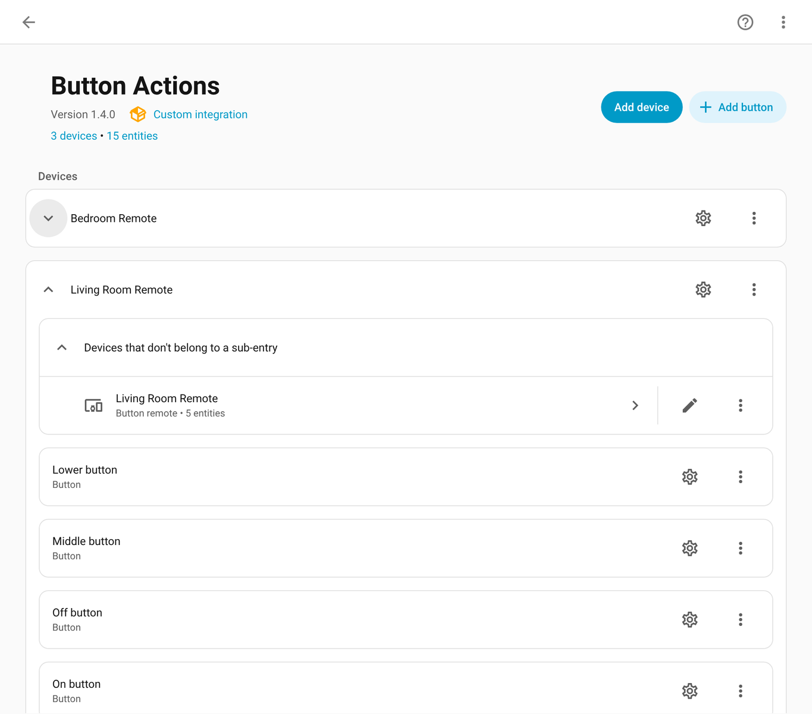
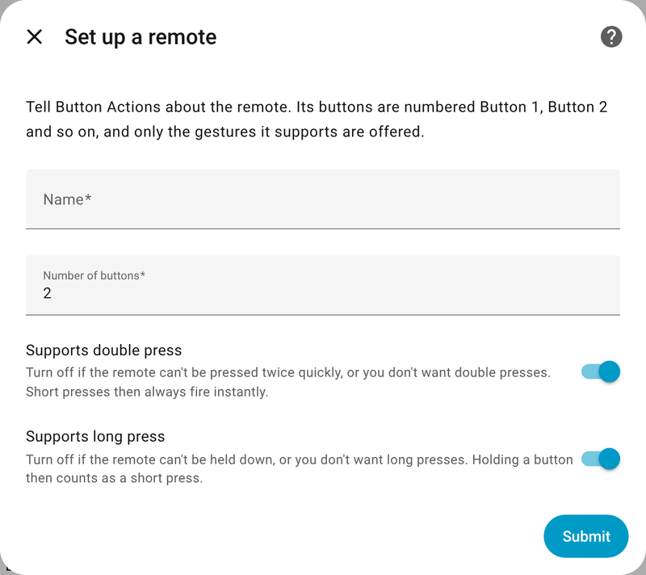
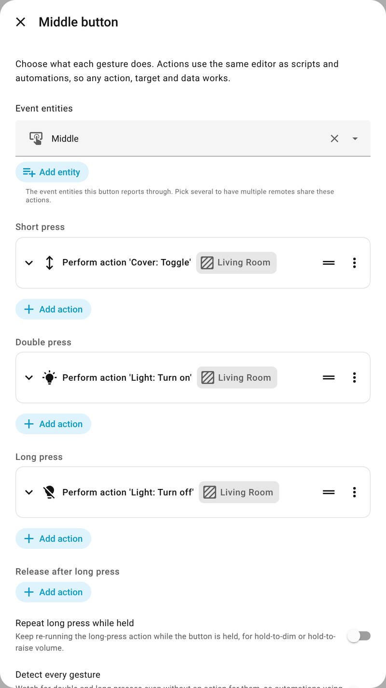

<p align="center">
  
</p>

# Button Actions

Map short, double and long presses on Lutron Pico and other button remotes to any Home Assistant action, configured entirely in the UI. No automations needed.

## Why

The usual way to get click, double-click and hold out of a Pico is a blueprint automation. That works, but:

- **Buttons block each other.** One automation handles every button, so while it waits out a hold on one button, presses on another can be dropped or queued.
- **Timing is loose.** Template triggers and `wait_for_trigger` add latency, which matters inside a 250 ms double-click window.
- **Short presses always wait.** The automation can't know you never set a double-click action, so every short press waits for one.
- **Hold-to-dim is awkward.** Repeating an action while a button is held isn't something a blueprint does well.

Button Actions runs a small state machine per button inside Home Assistant, so every button is independent, timing is tight, and each remote is just a device you configure.

<p align="center">
  
</p>

## Features

- **Gestures per button:** short press, double press, long press, and release after a long press.
- **Any action:** each gesture uses the same action editor as scripts and automations. Target areas, devices or entities, use any service, add delays, conditions, templates.
- **Hold to repeat:** turn on repeat for a button and its long-press action keeps running while held. Pair it with `brightness_step_pct` or `volume_up` for hold-to-dim and hold-to-raise.
- **No waiting when you don't need it:** a button with no double-press action fires its short press the instant you let go. A button with no long-press action treats a long press as a short one.
- **Import your blueprint automations:** convert automations made with the *Lutron Pico Universal Actions (Event Entities)* blueprint one at a time or all at once. Buttons, actions and timing carry over, the old automations are turned off for you, and remotes can read presses straight from Lutron.
- **Linked to your devices:** pick a Pico, hub or Zigbee remote and its buttons are found for you. The remote's gesture entities and triggers then appear on that device's own page.
- **Device triggers:** use "Living Room Remote: Middle button double pressed" in your own automations when you need one.
- **Repairs:** you're told if an imported blueprint automation gets turned back on (presses would run twice), or if a button's event entity or Pico disappears.
- **Gesture event entities:** each button also gets an event entity that reports `short_press`, `double_press`, `long_press` and `long_release`, so presses show up in the logbook and history. A remote linked to a device doesn't need them, since the device shows its own button events.
- **Lutron Caséta Picos built in:** pick a Pico from the core Lutron Caséta integration and its buttons are set up for you. No extra integration needed.
- **Works with other button devices too:** Matter switches and hub buttons, Zigbee, ESPHome and more. Each event type a device sends is recognized automatically, whether it reports presses and releases or detects single, double and held presses itself.
- **Duplicate a remote:** copy every button's actions to a new remote, with find-and-replace to retarget areas and entities in one step.
- **Download diagnostics:** a remote's config and each button's live state in one file, for bug reports.

## Requirements

- Home Assistant 2025.8 or newer. The integration icon shows in the UI on 2026.3 and newer.
- One of:
  - A Pico paired with the core **Lutron Caséta** integration, or
  - Event entities for each button, such as those from [lutron-caseta-events](https://github.com/jharris4/lutron-caseta-events), Matter, Zigbee or ESPHome.

## Installation

### HACS

1. In HACS, open the menu and choose **Custom repositories**.
2. Add `https://github.com/bisman-automations/ha-button-actions` as an **Integration**.
3. Install **Button Actions** and restart Home Assistant.

### Manual

Copy `custom_components/button_actions` into your `config/custom_components` folder and restart Home Assistant.

## Setup

Go to **Settings → Devices & services → Add integration → Button Actions**. To add more remotes later, use **Add device** on the Button Actions page.

### Pick a device

The quickest way. Pick the device the buttons belong to: a Lutron Caséta Pico, a hub such as a SwitchBot Hub 2, a Matter switch, a Zigbee or ESPHome remote. Its buttons are found automatically. A hub that puts its buttons on a separate device connected via it, as a SwitchBot Hub 2 does over Matter ("Hub Buttons"), works too: pick the hub or the buttons device.

- **Lutron Pico:** its On, Raise, Middle, Lower, Off and scene buttons are added, and presses are read straight from the Lutron Caséta integration.
- **Anything else:** you're shown the buttons that were found (Button 1, Button 2…) and asked whether the device supports double and long press. Long press is filled in from the event types the device reports.

Then use the ⚙ next to each button to choose what it does.

The remote is linked to the device its buttons are on. On Home Assistant 2026.8 and newer, each device's page lists the other under **Linked devices**, the same way a controller and its network client are linked; older versions show the remote as connected via the device. The remote uses the device's own button events and doesn't add any of its own.

Some devices only report a press, with no release and nothing for a held button. A SwitchBot Hub 2's on and off buttons work this way. Long press is then turned off for you. If a quick second press doesn't register either, turn off **Supports double press** too, so short presses fire instantly.

### Import from a blueprint automation

Pick an automation made with the Pico blueprint. Its button entities, every short, double and long-press action, and its timing are copied over. Leave **Turn off the original automation** checked so presses don't run twice. Nothing is deleted.

If every button belongs to a Pico in the Lutron Caséta integration, you're asked whether to read presses straight from Lutron. That's recommended, since the remote then doesn't need its event entities.

### Import all Pico blueprint automations

Lists every Pico blueprint automation that hasn't been imported yet, with all of them selected. Each one becomes its own remote. Turn on **Read presses from Lutron when possible** to set up Pico-backed remotes wherever that works.

### Duplicate an existing remote

Pick a remote to copy and give the copy a name. Every button's actions, its repeat and detection settings, and the click timing are copied over.

Use **Find** and **Replace with** to change text in every copied action at once. For example, find `boys_bedroom` and replace it with `girls_bedroom` to retarget a whole remote's areas and lamps. Then choose where the copy reads presses from: a Lutron Caséta Pico, or its own event entities. The original remote isn't changed.

### Set up a remote by hand

For buttons that don't belong to one device, or when you want to pick each button's event entity yourself:

1. Give the remote a name and say how many buttons it has (up to 12).
2. Say whether it supports **double press** and **long press**. Gestures a remote doesn't support aren't offered on its buttons, aren't timed, and don't show up as device triggers. Without double press, short presses always fire instantly; without long press, holding a button counts as a short press.
3. Pick the event entity for each of **Button 1**, **Button 2** and so on. You can pick more than one entity for a button so several remotes share the same actions.

<p align="center">
  
</p>

You can change the double and long press switches later under **Reconfigure**, and add more buttons with **Add button**.

#### Event types

Button devices report presses differently, and Button Actions recognizes the common ways automatically:

| Device sends | For example | What happens |
| --- | --- | --- |
| A press and a release | Lutron (`press`, `release`), Matter (`initial_press`, `short_release`, `long_release`) | Button Actions times short, double and long presses itself. |
| A press only | Matter switches without release support (`initial_press`) | Each press counts as a full press. Double presses work; long presses can't be detected. |
| Gestures it detects itself | Matter multi-press (`multi_press_1`, `multi_press_2`, `long_press`), Zigbee (`single`, `double`, `hold`) | Those gestures are used as they are. Hold-to-repeat still works. |

If a device uses names that aren't recognized, open **Reconfigure** on the remote. It lists every event type the buttons send and what each one means, and you can change any of them.

## Configuring buttons

Each remote lists its buttons right under it on the Button Actions integration page, as in the screenshot at the top. Buttons and their gesture entities are numbered top to bottom ("1 · On", "2 · Raise"…), because Home Assistant sorts these lists alphabetically and the numbers keep them in the order they sit on the remote.

| Control | What it does |
| --- | --- |
| ⚙ next to a button | Set its short press, double press, long press and release-after-long-press actions, whether the long press repeats while held, whether to detect every gesture, and which event entities feed it. |
| ⋮ next to a button | Delete that button. Its gesture entity is removed too. |
| ⚙ on the remote | Click timing for the whole remote: double-press window, hold time and repeat interval. |
| ⋮ on the remote → **Reconfigure** | Rename the remote, turn double and long press support on or off, link it to the device its buttons belong to, check or change what each event type means, or switch it to a Lutron Caséta Pico. |
| ⋮ on the remote → **Download diagnostics** | Save the remote's config and live button state, to attach to a bug report. |
| **Add button** at the top of the page | Add a button you skipped during setup to one of your remotes. |

<p align="center">
  
</p>

Actions get these variables for templates: `remote` (the remote's name), `button` (`on`, `raise`, `stop`, `lower`, `off`, `button_1` … `button_4`) and `gesture`.

### Switching a remote to core Lutron

Remotes imported from the blueprint use event entities from lutron-caseta-events. To read presses straight from the Lutron Caséta integration instead, open **Reconfigure** on the remote and pick its Pico. If the event entities belong to the Pico's device, it's already filled in. Every button keeps its actions, and once all your remotes are switched you no longer need lutron-caseta-events.

### Using a button in your own automations

Each remote has triggers for every button and gesture, such as *"Middle button" double pressed*. In the automation editor, pick the remote's own device (named after the remote, and listed under **Linked devices** on its Pico or button device). On Home Assistant 2026.4 and newer, a remote that isn't linked to a device can also use **Event received** on a button's gesture entity.

A button only waits for double and long presses when it has an action for them, so its short presses stay instant. To use a double or long press only from an automation, turn on **Detect every gesture** on that button. Its short presses then wait briefly for a possible second press.

### Hold-to-dim example

On the **Raise** button, set the long-press action to:

```yaml
action: light.turn_on
target:
  area_id: living_room
data:
  brightness_step_pct: 10
```

Turn on **Repeat long press while held**. Holding Raise now steps the lights up every repeat interval until you let go. Do the same on **Lower** with `-10`.

## Timing defaults

| Setting | New remote | Imported remote |
| --- | --- | --- |
| Double-press window | 300 ms | the blueprint's value, or 250 ms |
| Hold time | 600 ms | the blueprint's value, or 1000 ms |
| Repeat interval | 400 ms | 400 ms |

Imported remotes keep the blueprint's timing so they feel the same as before. Lowering the hold time to around 600 ms makes long presses noticeably snappier.

## Upgrading

### To 1.7.0

Existing remotes are linked to their Pico or button device automatically, and entity IDs don't change. To link a remote whose buttons come from more than one device, pick a device under **Reconfigure**.

### From 1.0.0

Remotes set up with 1.0.0 convert automatically the first time Home Assistant starts with 1.1.0. Each button becomes its own entry under the remote with its actions intact, and entity IDs don't change.

## Notes

- Gesture event entities and device triggers only report gestures the button is watching for. A button with no double-press action never reports `double_press` unless **Detect every gesture** is on.
- If a release event goes missing, the next press resets the button, and repeat stops after 30 seconds, so a button can't get stuck.

## License

MIT
